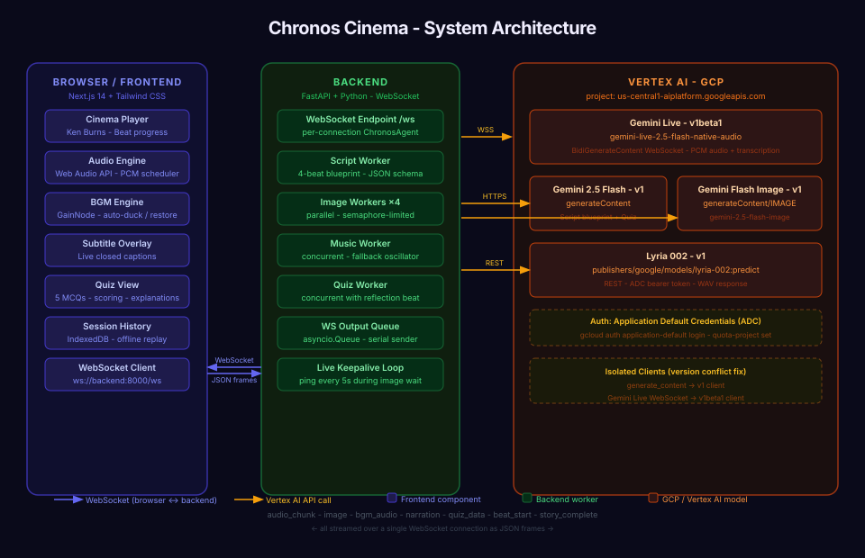

# Chronos Cinema — AI Documentary Studio

An AI agent that produces cinematic, multimodal educational documentaries on any topic. Enter a subject and watch a live director, narrator, cinematographer, and composer collaborate in real time to generate a fully synchronized documentary — narration, video, images, and music as one cohesive unit.

**Hackathon category:** Creative Storyteller — multimodal interleaved output

---

## Architecture



*Full diagram: [`docs/architecture.svg`](docs/architecture.svg)*

The browser opens a WebSocket to the FastAPI backend. The backend creates a per-connection `ChronosAgent` using the user-supplied API key, opens a Gemini Live session on Vertex AI, and runs parallel workers for script, images (Imagen), video (Veo), and music (Lyria). All media streams back to the frontend in real time over the same WebSocket.

---

## For Judges: How to Test

> **Quickest path:** API-key mode — no GCP account needed, just a Gemini API key.

### Option A — API-Key Mode (fastest, ~2 min setup)

> Lyria music and Veo video require a GCP project (Option B). In API-key mode the app falls back to ambient BGM and Imagen stills only — narration, images, and quiz still work fully.

**1. Start the backend**

```bash
cd backend
python3 -m venv .venv && source .venv/bin/activate
pip install -r requirements.txt
# No .env required — API key is entered in the browser UI
uvicorn main:app --host 0.0.0.0 --port 8000 \
  --ws websockets-sansio --ws-ping-interval 60 --ws-ping-timeout 60
```

**2. Start the frontend**

```bash
cd frontend
npm install
npm run dev
```

**3. Open the app**

Open **http://localhost:3000**, enter your **Gemini API key** in the key field (it stays in your browser session only), type a topic, and click **▶ Produce My Documentary**.

> Get a key at [aistudio.google.com/apikey](https://aistudio.google.com/apikey) — the free tier works.

---

### Option B — Full GCP Project Mode (all features: Veo + Lyria + GCS)

**Prerequisites:** GCP project with billing enabled, `gcloud` CLI installed.

**1. Enable APIs and authenticate**

```bash
gcloud services enable aiplatform.googleapis.com \
  run.googleapis.com cloudbuild.googleapis.com \
  artifactregistry.googleapis.com storage.googleapis.com

gcloud auth application-default login
gcloud auth application-default set-quota-project YOUR_PROJECT_ID
```

**2. Configure `backend/.env`**

```bash
VERTEX_AUTH_MODE=project
GOOGLE_CLOUD_PROJECT=your-gcp-project-id
GOOGLE_CLOUD_LOCATION=us-central1

# Required for Veo to write output artifacts:
VEO_OUTPUT_GCS_URI=gs://your-bucket/chronos-veo-output
```

**3. Run both services**

```bash
chmod +x start.sh && ./start.sh
```

Open **http://localhost:3000** — no API key field appears when the backend is already configured via env.

---

### What to Expect During a Run

| Time | What happens |
|------|-------------|
| 0 s | Enter topic → click Produce |
| ~5–10 s | Script generated, all renders fire simultaneously |
| ~15–25 s | First scene image ready → narrator begins |
| ~30–60 s | Subsequent images arrive (pre-rendered during previous beat) |
| ~60–180 s | Veo cinematic clips arrive and silently upgrade each scene |
| Ongoing | BGM under narration; auto-ducks when narrator speaks |
| After narration | 5-question quiz generated from the documentary content |

---

### Feature Checklist for Judges

- [ ] **Live narration** — Gemini Live audio plays beat-by-beat with closed captions (CC toggle top-right)
- [ ] **Interleaved visuals** — Imagen stills appear before each beat; Veo clips silently upgrade them
- [ ] **Background score** — Music plays and ducks under narration (Lyria in project mode, ambient fallback otherwise)
- [ ] **Voice interruption** — Click the mic icon during narration and speak to redirect the story
- [ ] **Chat interruption** — Type in the chat bar at the bottom during narration
- [ ] **Quiz** — Answer 5 multiple-choice questions after the documentary; see explanations and score
- [ ] **Replay** — Click any entry in the history sidebar to replay the full session without re-calling any API
- [ ] **Theater mode** — Click the resize icon on the cinema frame for fullscreen theatre view

---

## How It Works

1. **Script** — Gemini 2.5 Flash writes an 8-beat documentary arc (Hook → Foundation → Mechanism → Scale → Counterintuitive → Human Connection → Frontier → Reflection), ~200 words per beat.
2. **Images** — Imagen 4.0 Fast pre-renders all 8 scene stills in parallel (~10-15s each). Narration is held until the first frame is ready — the narrator never speaks to a black screen.
3. **Narration** — Gemini Live streams native audio beat-by-beat. Each beat starts only after its image is on screen. Ken Burns pan-zoom animations make stills feel cinematic.
4. **Video upgrade** — Veo 3.1 generates full cinematic clips in the background (60-180s). When each clip is ready it silently replaces its scene's still image.
5. **Music** — Lyria composes a custom background score. A fallback ambient track plays immediately while Lyria renders. BGM auto-ducks during narration and restores between beats.
6. **Quiz** — After the documentary, Gemini generates 5 multiple-choice questions from the script. Interactive quiz with scoring and per-question explanations.
7. **Interruptions** — Voice (mic) and chat can interrupt the narrator at any time.

---

## Tech Stack

| Component | Model / Service |
|-----------|----------------|
| Narration (live audio) | `gemini-live-2.5-flash-native-audio` |
| Script generation | `gemini-2.5-flash` |
| Quiz generation | `gemini-2.5-flash` |
| Video generation | `veo-3.1-generate-001` |
| Image generation | `imagen-4.0-fast-generate-001` |
| Music generation | `lyria-002` |
| Cloud platform | Vertex AI + Cloud Run + Cloud Storage |
| Backend | FastAPI + Python, WebSocket streaming |
| Frontend | Next.js 14, Tailwind CSS, Web Audio API |

---

## Prerequisites

- Python 3.10+
- Node.js 18+
- A Gemini API key **or** a Google Cloud project with Vertex AI enabled

---

## Quick Start (Local)

### 1. Backend setup

```bash
cd backend
python3 -m venv .venv
source .venv/bin/activate       # Windows: .venv\Scripts\activate
pip install -r requirements.txt
```

### 2. Frontend setup

```bash
cd frontend
npm install
```

The frontend connects to `ws://localhost:8000/ws` by default. To use a different backend URL:

```bash
# frontend/.env.local
NEXT_PUBLIC_WS_URL=ws://your-backend-host/ws
```

### 3. Run both services

**Option A — single command:**
```bash
chmod +x start.sh
./start.sh
```

**Option B — separately (two terminals):**

Terminal 1 — backend:
```bash
cd backend
source .venv/bin/activate
uvicorn main:app --host 0.0.0.0 --port 8000 \
  --ws websockets-sansio --ws-ping-interval 60 --ws-ping-timeout 60
```

Terminal 2 — frontend:
```bash
cd frontend
npm run dev
```

Open **http://localhost:3000** and enter your API key in the UI.

---

## Automated Cloud Deployment

The deployment is fully automated via [`deploy_cloud_run.sh`](deploy_cloud_run.sh).

The script ([`deploy_cloud_run.sh`, line 16](deploy_cloud_run.sh#L16)):
- Enables all required GCP APIs (`aiplatform`, `run`, `cloudbuild`, `artifactregistry`, `storage`)
- Builds and deploys the backend from source using `gcloud run deploy --source`
- Passes all environment variables as Cloud Run env vars
- Outputs the deployed service URL

```bash
export GOOGLE_CLOUD_PROJECT=your-project-id
export GOOGLE_CLOUD_LOCATION=us-central1
export VEO_OUTPUT_GCS_URI=gs://your-bucket/chronos-veo-output
chmod +x deploy_cloud_run.sh
./deploy_cloud_run.sh
```

Then set `NEXT_PUBLIC_WS_URL=wss://your-cloud-run-url/ws` in your frontend environment and deploy the frontend to Vercel or any static host.

---

## Notes

- **API key in UI** — The Gemini API key is entered in the browser and transmitted only to your own backend over the WebSocket. It is stored in `sessionStorage` (clears on tab close) and never persisted to a server.
- **Veo quota** — Veo generation is quota-sensitive. The app always shows an Imagen still first; Veo is a bonus upgrade. If Veo fails or times out, the still stays.
- **Lyria quota** — Requires `VERTEX_AUTH_MODE=project`. In `api_key` mode the BGM fallback (ambient track) plays instead.
- **Browser autoplay** — Web Audio requires a user gesture before audio starts. Clicking "Produce My Documentary" satisfies this.
- **Mic input** — Uses `MediaRecorder` at 16kHz mono. Chrome/Edge work best. Safari may require additional permissions.
