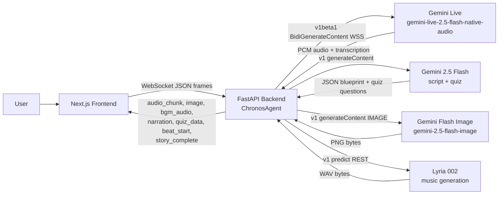

# Chronos Cinema Architecture

## Flow

1. Frontend opens a WebSocket to the backend and sends a `start` message with the topic.
2. Backend generates a 4-beat script blueprint (Hook, Foundation, Mechanism, Reflection) via Gemini 2.5 Flash.
3. All 4 scene images start rendering in parallel via `gemini-2.5-flash-image`.
4. Lyria 002 composes a background score concurrently; a fallback ambient oscillator plays immediately.
5. Backend opens a Gemini Live session (`v1beta1`) and holds narration until beat 0's image is ready, sending keepalive pings every 5s to prevent idle timeout.
6. Narration streams beat-by-beat; each beat's image is shown with Ken Burns animation.
7. Quiz generation runs concurrently with the closing reflection beat.
8. `quiz_data` is sent after the reflection `turn_complete`; `story_complete` follows immediately after.
9. Frontend waits for the audio stream to fully drain before transitioning to the quiz screen.

## Auth

All Vertex AI calls use Application Default Credentials (ADC) with `VERTEX_AUTH_MODE=project`.
Two isolated `genai.Client` instances are used to avoid API version conflicts:
- `v1` client for all `generate_content` calls (script, images, TTS fallback)
- `v1beta1` client exclusively for the Gemini Live WebSocket
